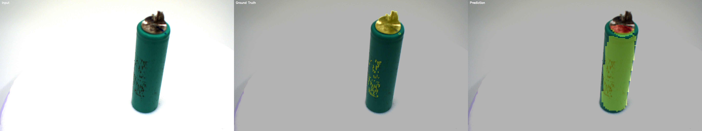

# 🔋 AI 기반 배터리 불량 검출 및 분석 시스템

AI 기반 Multiclass Semantic Segmentation을 통해  
배터리 결함의 위치 검출과 유형 분류를 동시에 수행하는 자동화 검사 시스템 개발

U-Net 기반 Multiclass Semantic Segmentation을 활용하여  
배터리 외관 이미지에서 불량을 자동으로 검출하고,  
불량 유형별 분석이 가능한 AI 검사 시스템을 구현했습니다.

---

##  프로젝트 개요

기존 수작업 검사 방식은 속도, 정확도, 일관성 측면에서 한계가 존재합니다.  
본 프로젝트는 이를 해결하기 위해 AI 기반 자동 검사 시스템을 구축하고,  
불량 위치 검출 및 유형 분류를 동시에 수행합니다.

---

##  사용 기술

- Python
- PyTorch
- OpenCV
- NumPy
- Matplotlib

---

##  데이터셋

- AIHub 배터리 외관 검사 데이터 사용
- 약 6,000장 이미지 및 JSON 라벨 활용
- Polygon 기반 라벨 → Pixel Mask 변환

---

##  전처리 파이프라인

- JSON (Polygon 좌표) → Mask 이미지 변환
- 시각 검증용: 0 / 127 / 255 저장
- 학습용 변환: 127 → 1, 255 → 2

---

##  모델 구조

- U-Net 기반 Semantic Segmentation
- Multiclass 구조 (3 classes)
  - Background (0)
  - Damaged (1)
  - Pollution (2)

---

##  문제점 (Baseline)

- 배경 클래스에 편향된 학습 발생
- 결함(Damaged), 오염(Pollution) 성능 저하
- 클래스 불균형 문제 확인

---

##  개선 전략

- Multiclass Segmentation 적용
- Weighted CrossEntropy Loss 적용
- 소수 클래스 학습 강화

---

## 📈 성능 결과

| Metric | Baseline | Improved |
|-------|--------|---------|
| Mean IoU | 0.4962 | 0.5095 |
| Mean Dice | 0.5314 | 0.5752 |

- Pollution IoU: **0.1538 → 0.2234 (약 45% 향상)**
- Background 클래스 편향 문제를 완화하고, 소수 클래스 성능 개선 확인

---

##  결과 예시

> Input / Ground Truth / Prediction 비교



---

## 🎯 주요 성과

- 불량 위치 검출과 유형 분류를 동시에 수행
- 클래스 불균형 문제 개선
- 실제 제조 공정 적용 가능성 확보

---

## 💡 프로젝트 의미

- 수작업 검사 자동화 가능
- 검사 정확도 및 일관성 향상
- 불량 유형별 대응 및 원인 분석 가능

---

##  프로젝트 구조

```text
battery-defect-detection/
├── results_test/
│   ├── metrics.txt
│   └── segmentation_result.png
├── splits/
│   ├── train.txt
│   ├── val.txt
│   └── test.txt
├── src/
│   ├── dataset.py
│   ├── inference.py
│   ├── model.py
│   ├── preprocess.py
│   ├── train.py
│   └── visualize.py
├── make_split.py
├── make_test_split.py
└── README.md
